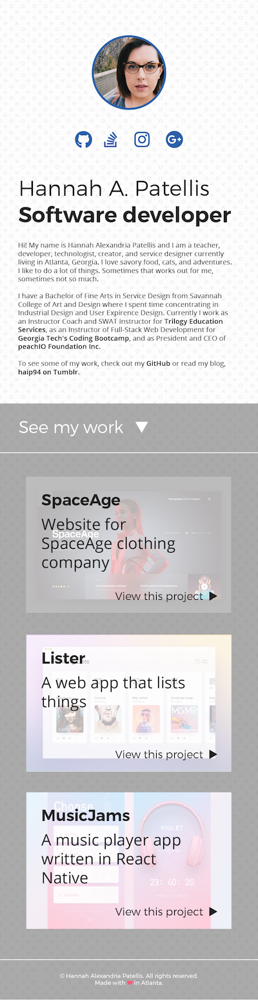
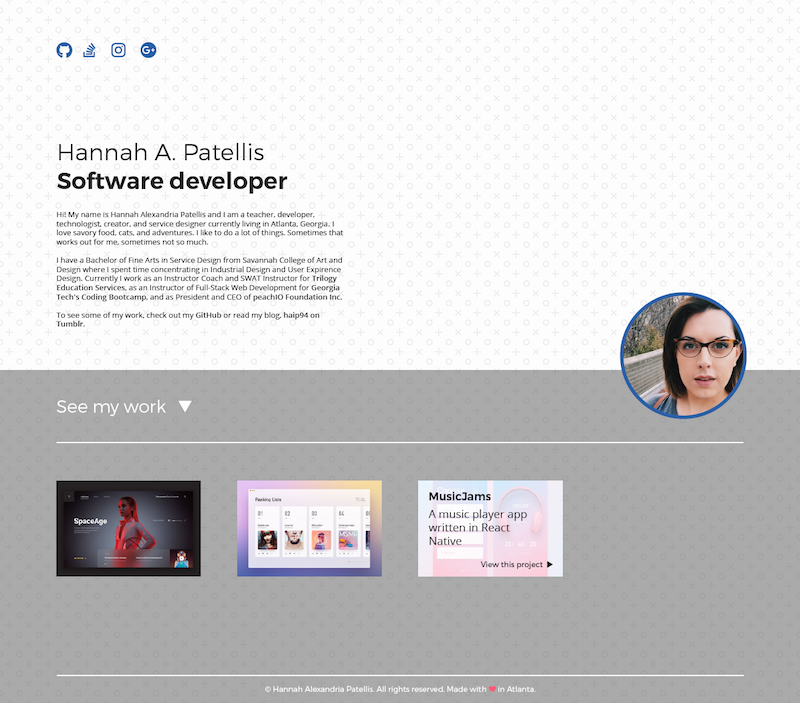
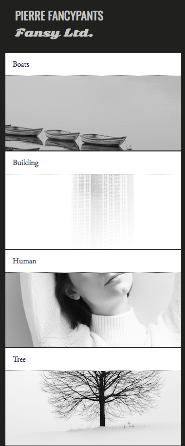
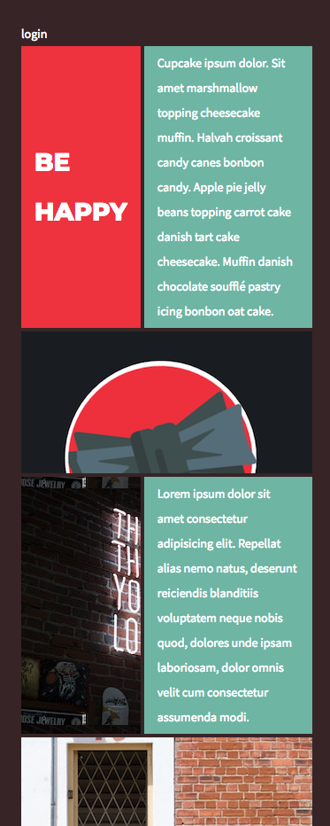
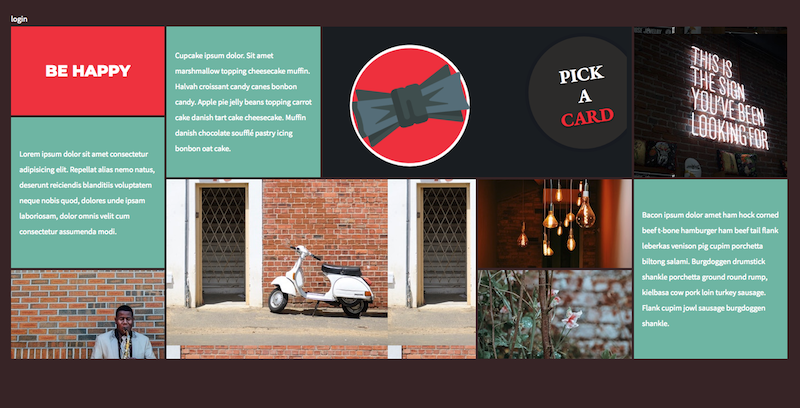

# Homework 2 - CSS Grid and DOM Fundamentals

There are **2 parts** to this homework. The homework is only complete if **both** parts are submitted.

Homework is only incomplete if 1 or more parts are not submitted. Non-working code is **not** an incomplete. Please turn in any code you have. 

**This homework is due Saturday August 26th at 5pm.** Late submissions are not accepted. 

*Note:* Mobile versions only show the top part of the page. No divs or images need to be hidden in these mobile designs.

## Part 1: Portfolio

As a developer, an important part of your job is matching the design teams files **exactly**. In the interest of matching the work environment as closely as possible, all of your homeworks will include design files that must be matched. 

This week's homework is about mastering CSS grid. Mastery comes from many hours of practice and this homework is about just that! 

Start by completing your portfolio website from last week. Use CSS grid to match the layouts below.

Mobile:

Desktop:

Additionally, you will need to complete **ALL** of the designs below. You will find all of the necessary assets in Unit 2 activities 15,16, and 17.

### Design 1
Working from scratch, build the layouts below:

Mobile:

Desktop:

### Design 2

Working from scratch, build the layouts below:

Working with the HTML provided, build the layouts below ( note there are 3 ):

Mobile:

Medium:

Desktop:

### Design 3

Mobile:

Desktop:

  ---

  ## Part 2: DOM Fundamentals

  Read the following article: [https://www.digitalocean.com/community/tutorials/introduction-to-the-dom](https://www.digitalocean.com/community/tutorials/introduction-to-the-dom)

  * You may need to read the article several times to fully understand it. 

  * You may need to Google concepts that you don't fully understand. 

  * When you fully understand the article, write a synopsis as though you are explaining the concepts to a ten year old. 

  * Your summary must be at least 150 words.
  
  * Your summary must include one analogy. Example "A conditional is like a fork in the road. You go one way if you want to go home and another if you want to go to work"

  

